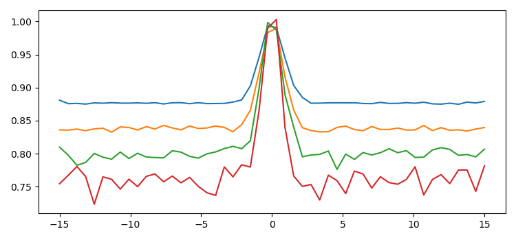
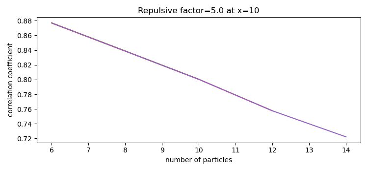
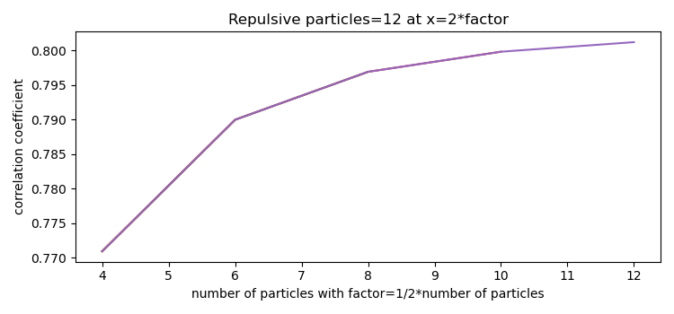
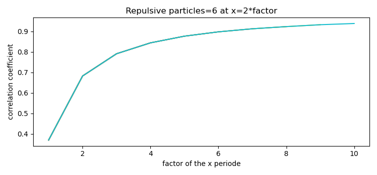

This python script uses torchquad to do Monte Carlo integrations on multi-particle wave functions of bosons, formed by two fermions with repulsive behavior. This is a very basic approach and any comments in the issues are appreciated.

We use a simple two particle wave function with "repulsion" for the two different particles a and b
$$\phi_c(a,b)=1-e^{-(a-b)^2}$$
From this we define a multiparticle wave function
$$\phi((a_1,a_2,...,a_n),(b_1,b_2,...,b_n))=\prod_{i=1}^n \phi_c(a_i,b_i)$$
This wave function has to symmetrized with respect to the particles a and b
$$\phi_s((a_1,a_2,...,a_n),(b_1,b_2,...,b_n))=\sum_{i,j} s(P_i(a))\cdot s(P_j(b))\cdot\phi(P_i(a),P_i(b))$$
with $P_i(a)$ and $P_j(b)$ being the permutations of the particles a and b and $s(P)$ being the signatures of the permutation with values 1 and -1.

The wave function is used with periodic boundary conditions $-\pi$ to $\pi$ multiplied with "factor".

We analyse the off diagonal correlation function 
$$g_{2}(x)=\frac{\rho_{ab}(0,0;x,x)}{\sqrt{\rho_{ab}(0,0;0,0)\rho_{ab}(x,x;x,x)}}$$

This looks like these systems show off diagonal long range order (ODLRO). It seems even possible to add momentum to the $\phi_c$ wave function without harming ODLRO.
