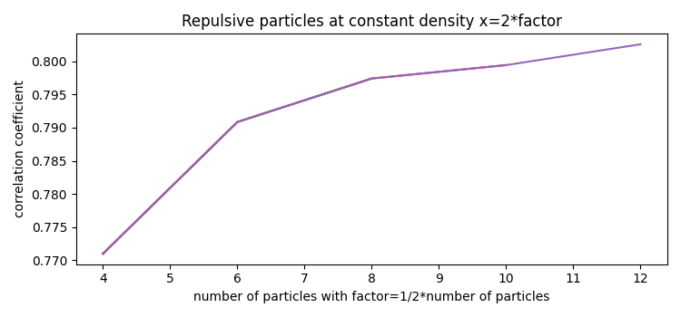

This python script uses torchquad to do Monte Carlo integrations on multi-particle wave functions of bosons, formed by two fermions with repulsive behavior. This is a very basic approach and any comments in the issues are appreciated.

We use a simple two particle wave function with "repulsion" for the two different particles a and b
$$\phi_c(a,b)=1-e^{-(a-b)^2}$$
From this we define a multiparticle wave function
$$\phi((a_1,a_2,...,a_n),(b_1,b_2,...,b_n))=\prod_{i=1}^n \phi_c(a_i,b_i)$$
This wave function has to symmetrized with respect to the particles a and b
$$\phi_s((a_1,a_2,...,a_n),(b_1,b_2,...,b_n))=\sum_{i,j} s(P_i(a))\cdot s(P_j(b))\cdot\phi(P_i(a),P_i(b))$$
with $P_i(a)$ and $P_j(b)$ being the permutations of the particles a and b and $s(P)$ being the signatures of the permutation with values 1 and -1.

The wave function is used with periodic boundary conditions $-\pi$ to $\pi$ multiplied with "factor".

We analyse the off diagonal correlation function 
$$g_{2}(x)=\frac{\rho_{ab}(0,0;x,x)}{\sqrt{\rho_{ab}(0,0;0,0)\rho_{ab}(x,x;x,x)}}$$

This looks like these systems show off diagonal long range order (ODLRO). It seems even possible to add momentum to the $\phi_c$ wave function without harming ODLRO.

References:

[1] C. K. Law, Quantum entanglement as an interpretation of bosonic character in composite
two-particle systems, Phys. Rev. A 71, 034306 (2005), https://arxiv.org/abs/quant-ph/
0411040.

[2] M. D. Jiménez, E. Cuestas, A. P. Majtey and C. Cormick, Composite-boson formalism applied
to strongly bound fermion pairs in a one-dimensional trap, SciPost Phys. Core 6, 012 (2023),
doi:10.21468/SciPostPhysCore.6.1.012.

[3] L. Amico, R. Fazio, A. Osterloh and V. Vedral, Entanglement in many-body systems, Rev.
Mod. Phys. 80, 517 (2008), https://arxiv.org/abs/quant-ph/0703044.

[4] C. Cormick and L. Ermann, Ground state of composite bosons in low-dimensional graphs,
Phys. Rev. A 107, 043324 (2023), doi:10.1103/PhysRevA.107.043324, https://arxiv.org/
abs/2304.14834.

[5] T. Sowiński, M. Gajda and K. Rzażewski, Pairing in a system of a few attractive fermions
in a harmonic trap, Europhysics Letters 109(2), 26005 (2015), doi:10.1209/0295-
5075/109/26005.

[6] D. Schmicker, A multi particle toy system with analytic solutions to investigate composite bosons in a harmonic potential, https://arxiv.org/abs/2404.14430

